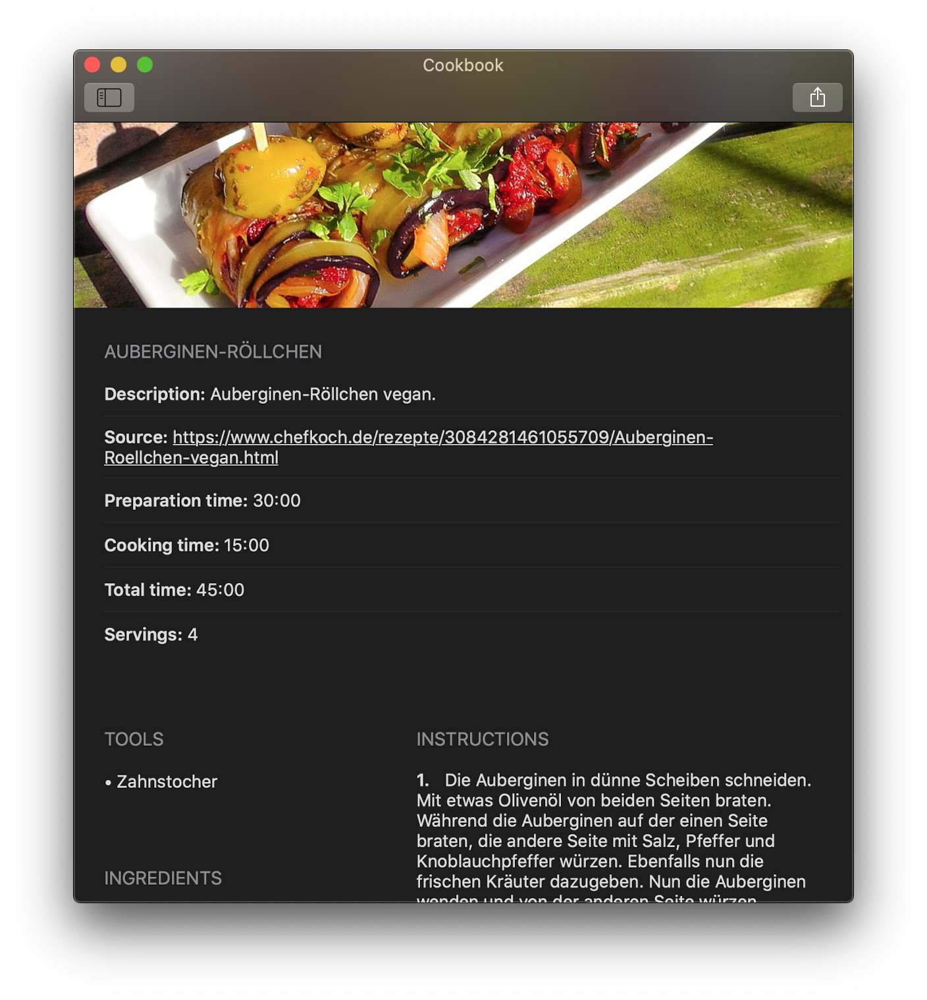
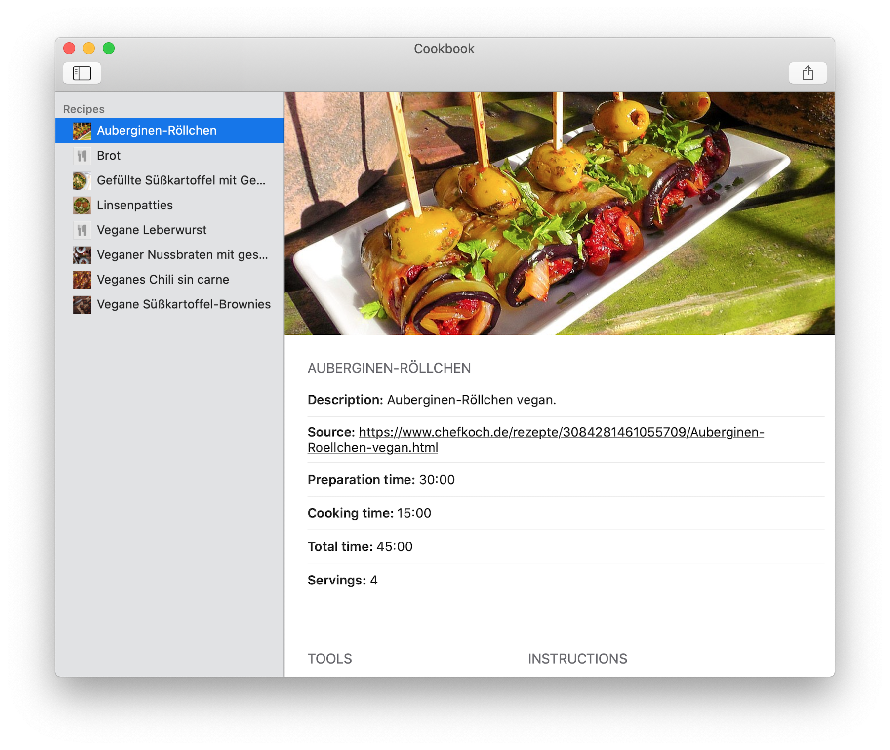
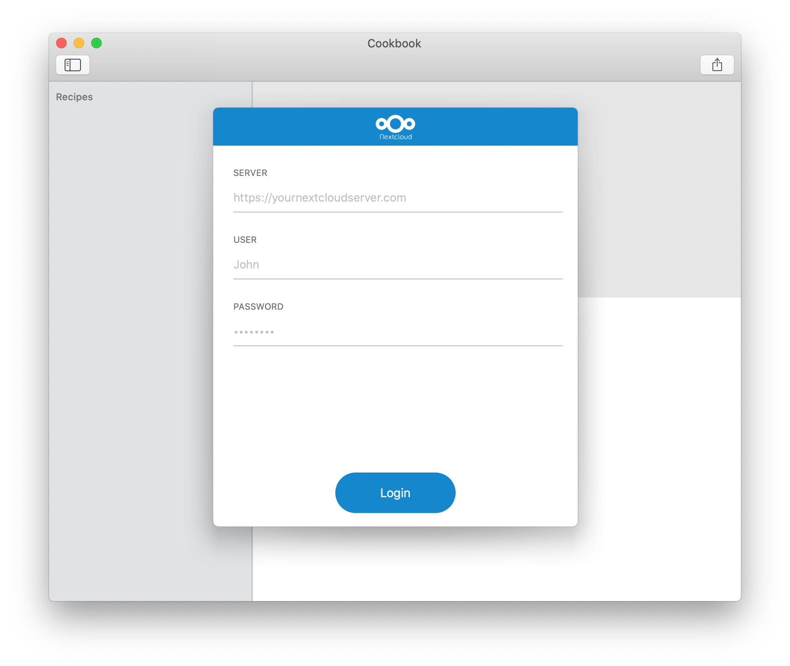
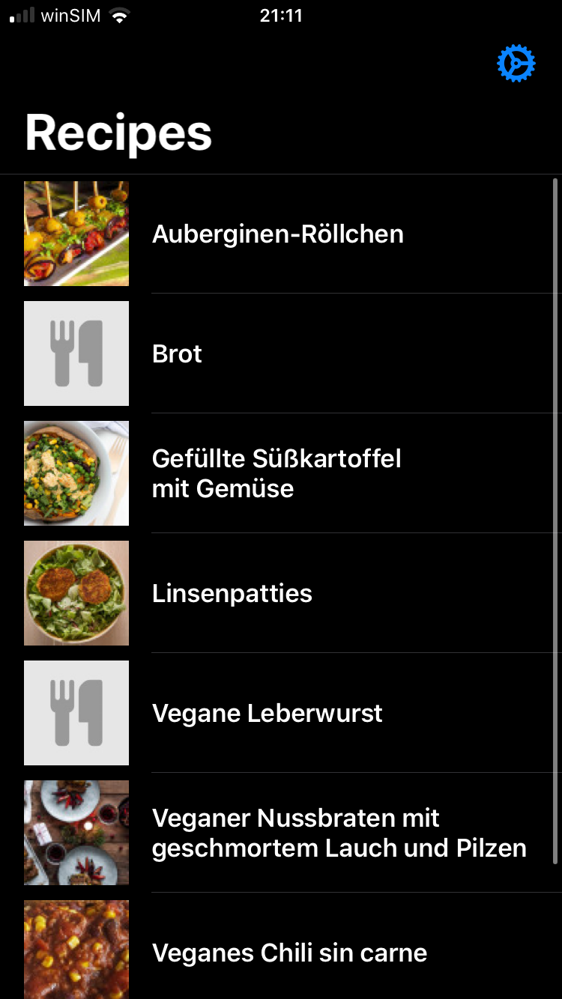
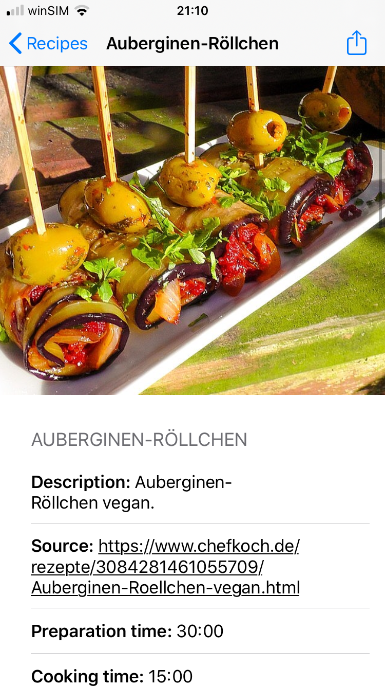
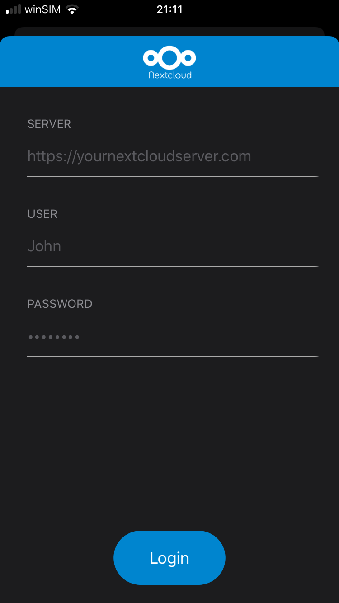
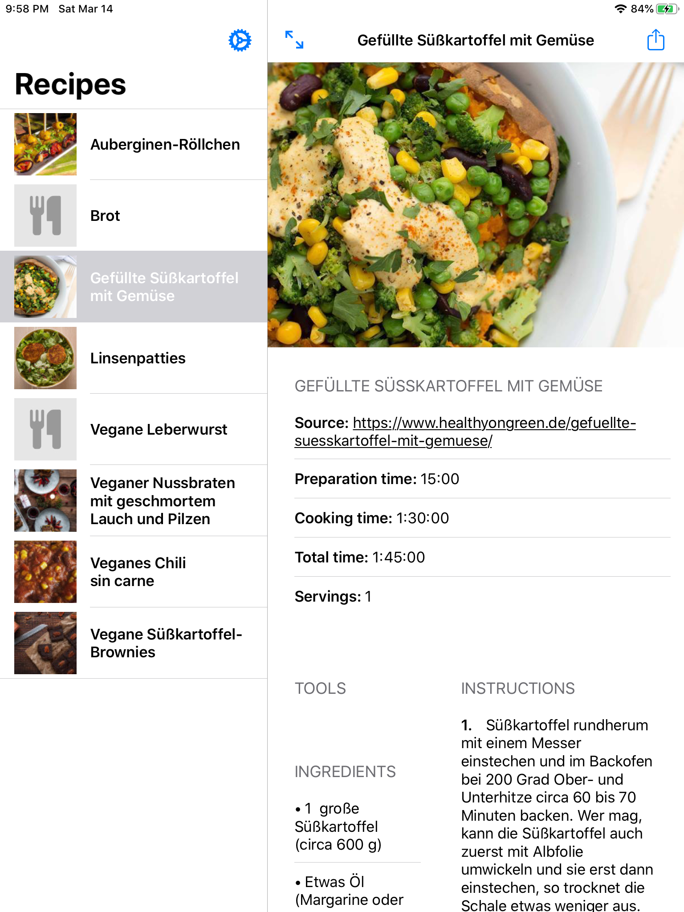
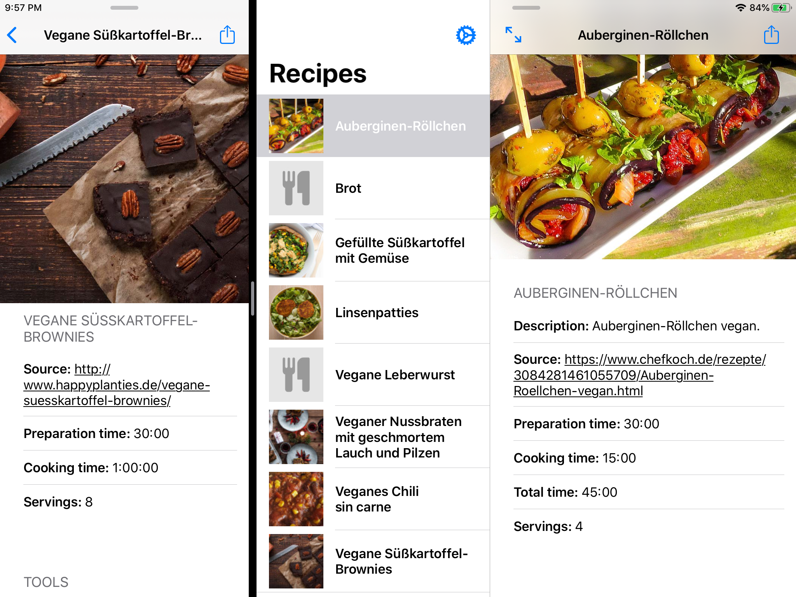
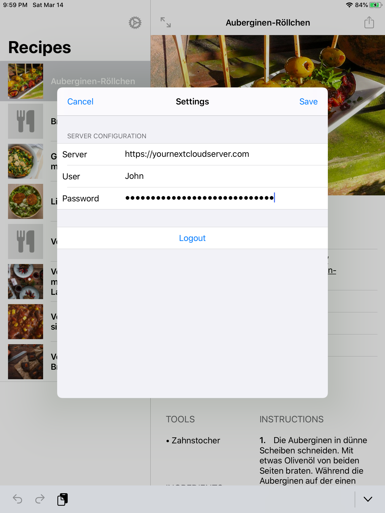

# Cookbook 

At the moment this application is a macOS / iOS / iPadOS viewer for your recipes stored in your NextCloud. For the corresponding NextCloud application see: [nextcloud-cookbook](https://github.com/mrzapp/nextcloud-cookbook). This is not a standalone application! Without the NextCloud backend this application is useless.

- [x] View recipes    
- [x] Share a recipe as pdf  
- [x] Support dark mode    
- [x] Support multiple windows    
- [x] Support autolayout / size classes  
- [ ] Add search function    
- [ ] Add / edit / delete recipe    
- [ ] Custom recipe folder    
- [ ] Keyboard shortcuts iOS    
- [ ] Offline support / Caching   
- [ ] Allow text selection
- [ ] NextCloud two factor authentication (use an application password) 

### macOS

|  |  |
|---|---|
|   |   |

### iOS

|  |  |
|---|---|
| |  |

### iPadOS

|  |  |
|---|---|
| | |