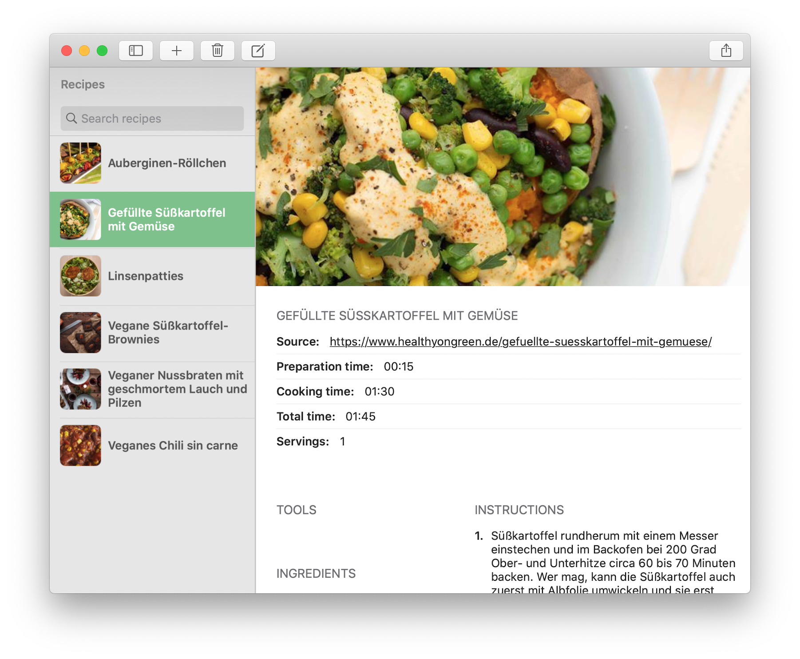
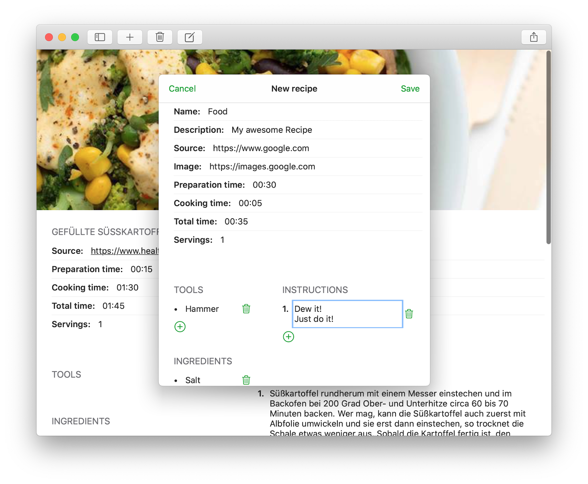

# Cookbook 

  
  <h2 align="center">Cookbook-Client</h2>

This is a Cookbook client application to manage your recipes stored in your NextCloud (Cookbook v6.0 and up). For the corresponding NextCloud application see: [nextcloud-cookbook](https://github.com/mrzapp/nextcloud-cookbook). This is not a standalone application! Without the NextCloud backend this application is useless.

- [x] View recipes    
- [x] Share a recipe as pdf  
- [x] Support dark mode    
- [x] Support multiple windows    
- [x] Support autolayout / size classes  
- [x] Support search function    
- [x] Allow text selection    
- [x] Support Add / edit / delete recipe   
- [x] Cookbook v.0.6 support 

**More enhancement ideas:**   
- [ ] Tooltips on macOS  
- [ ] Support Cookbook v0.6 categories   
- [ ] Custom recipe folder   
- [ ] Keyboard shortcuts iOS and macOS    
- [ ] Offline support / Caching   
- [ ] NextCloud two factor authentication (use an application password) 

### macOS

|  |  |
|---|---|
|   |   |

### iPadOS

|  |  |
|---|---|
| |  |

### iOS

|  |  |
|---|---|
| |  |
